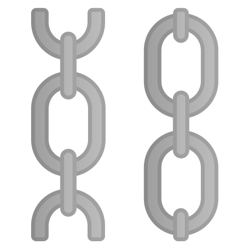

<!-- PROJECT SHIELDS -->
<!--
*** I'm using markdown "reference style" links for readability.
*** Reference links are enclosed in brackets [ ] instead of parentheses ( ).
*** See the bottom of this document for the declaration of the reference variables
*** for contributors-url, forks-url, etc. This is an optional, concise syntax you may use.
*** https://www.markdownguide.org/basic-syntax/#reference-style-links
-->

<!-- PROJECT LOGO -->
 

  

<h3 align="center">Unchained</h3>

  

    A website for recommending activities in Singapore
     
    <a href="https://github.com/joesurf/sgunchained-repo"><strong>Explore our documentation »</strong></a>
     
     
    <a href="">View Demo</a>
 
  

<!-- TABLE OF CONTENTS -->

  
Table of Contents

  <ol>
    <li>
      <a href="#about-the-project">About The Project</a>
      <ul>
        <li><a href="#built-with">Built With</a></li>
      </ul>
    </li>
    <li><a href="#roadmap">Roadmap</a></li>
    <li><a href="#contact">Contact</a></li>
  </ol>

<!-- ABOUT THE PROJECT -->

## About The Project

[![Product Name Screen Shot][product-screenshot]](https://the100club.netlify.app/)

(<a href="#top">back to top</a>)

Unchained is a website that provides a collection of activities for people to do in Singapore

### Built With

- [React.js](https://reactjs.org/)
- [Bootstrap](https://getbootstrap.com)

(<a href="#top">back to top</a>)

<!-- ROADMAP -->

## Roadmap

<a href=""><strong>Check out the website »</strong></a>

- [x] Home Page
- [x] Product Page

(<a href="#top">back to top</a>)

<!-- CONTACT -->

## Contact

Joseph Ong - joesurf.rk@gmail.com

Stefanie Sew - stefaniesew@gmail.com

(<a href="#top">back to top</a>)

<!-- ACKNOWLEDGMENTS -->

<!-- ## Acknowledgments

- 
- 
- 

(<a href="#top">back to top</a>)

<!-- MARKDOWN LINKS & IMAGES -->
<!-- https://www.markdownguide.org/basic-syntax/#reference-style-links -->

<!-- [contributors-shield]: https://img.shields.io/github/contributors/github_username/repo_name.svg?style=for-the-badge
[contributors-url]: https://github.com/github_username/repo_name/graphs/contributors
[forks-shield]: https://img.shields.io/github/forks/github_username/repo_name.svg?style=for-the-badge
[forks-url]: https://github.com/github_username/repo_name/network/members
[stars-shield]: https://img.shields.io/github/stars/github_username/repo_name.svg?style=for-the-badge
[stars-url]: https://github.com/github_username/repo_name/stargazers
[issues-shield]: https://img.shields.io/github/issues/github_username/repo_name.svg?style=for-the-badge
[issues-url]: https://github.com/github_username/repo_name/issues
[license-shield]: https://img.shields.io/github/license/github_username/repo_name.svg?style=for-the-badge
[license-url]: https://github.com/github_username/repo_name/blob/master/LICENSE.txt
[linkedin-shield]: https://img.shields.io/badge/-LinkedIn-black.svg?style=for-the-badge&logo=linkedin&colorB=555
[linkedin-url]: https://linkedin.com/in/linkedin_username-->
