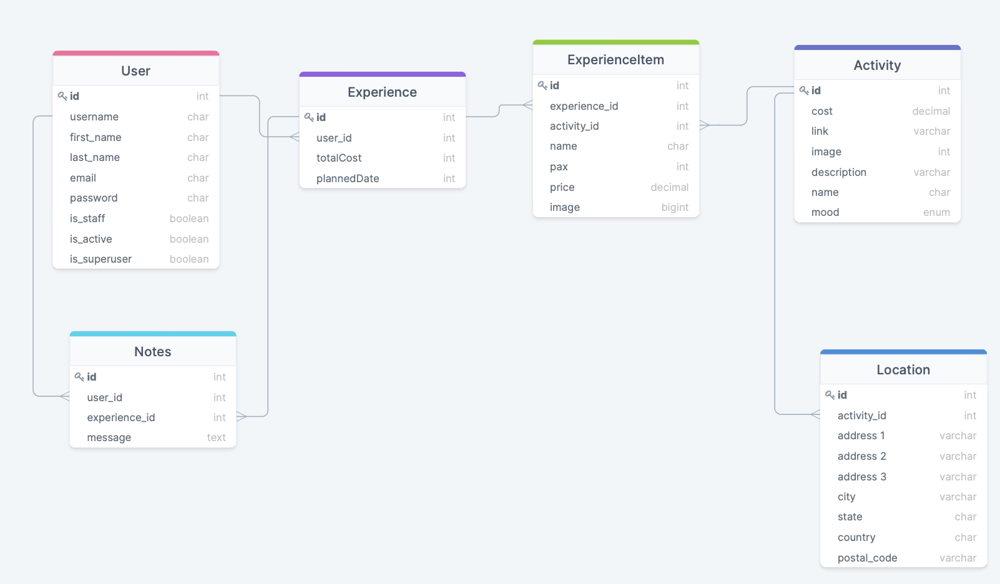

<!-- PROJECT SHIELDS -->
<!--
*** I'm using markdown "reference style" links for readability.
*** Reference links are enclosed in brackets [ ] instead of parentheses ( ).
*** See the bottom of this document for the declaration of the reference variables
*** for contributors-url, forks-url, etc. This is an optional, concise syntax you may use.
*** https://www.markdownguide.org/basic-syntax/#reference-style-links
-->

<!-- PROJECT LOGO -->
 

  

<h3 align="center">Unchained</h3>

  

    A website for recommending activities in Singapore
     
    <a href="https://github.com/joesurf/sgunchained-repo"><strong>Explore our documentation »</strong></a>
     
     
    <a href="">View Demo</a>
 
  

<!-- TABLE OF CONTENTS -->

  
Table of Contents

  <ol>
    <li>
      <a href="#about-the-project">About The Project</a>
      <ul>
        <li><a href="#built-with">Built With</a></li>
      </ul>
    </li>
    <li><a href="#roadmap">Roadmap</a></li>
    <li><a href="#contact">Contact</a></li>
  </ol>

<!-- ABOUT THE PROJECT -->

## About The Project

### Level of Achievement

Project Apollo

### Project Scope

Brief: Unchained is a web application that seeks to recommend unique experiences for students in Singapore based on how they are currently feeling.

Detailed: Visitors come to the website in search of interesting experiences in Singapore. The website aims to recommend activities that are cheap and easily accessible while being sufficiently novel for students, as most similar sites tend to focus on providing a marketplace and thus expensive activities. 

Users can choose to sign in to save their experiences as well as improve our recommendation by providing personal information and past selections. All users will first be directed to a landing page which seeks to understand their current mood or interest. After that, they will recommended a few activities based on their responses, of which they can filter based on various constraints like cost, location and availability. The website will also provide details for how to conduct the activities suggested.

After the experience, users can write personal notes about the experience which will be saved. They can also rate and comment on each particular activity or share their experience bucket with others. Activities which are not completed can be saved ot a wishlist. 

### Problem Motivation

When you are bored and want to go somewhere or do something exciting, your current
alternatives are friends, Google or social media. 

However, friends have limited knowledge about the best places to go or the most interesting activities to do. Google tend to provide search results of popular blogs which tend to have recommendations that are tailored toward the masses, that is, generic places or activities. Social media has by far the most interesting options, but sometimes lack key information on how to go to a particular place or how to conduct an activity due to the nature of the content.

But what if you would like to visit some place obscure, or do something extraordinary? What if you simply want a unique experience?

Currently, the closest real-time application of this idea is achieved by klook.com but its business model necessitates that its recommendations and experiences are common tourist attractions and paid activities, as opposed to more simple experiences like going for a picnic at Changi Jewel or catching the sunrise at Upper Seletar Reservoir.

### User Stories 

#### User
- [ ] As a user who wants a new experience, I want to be able to find interesting options quickly, subject to various constraints.
- [ ] As a user who is unsure where to start, I want places and activities to be recommended to me based on my past choices and my preferences.
- [ ] As a user who has tried the experience, I want to be able to note down my thoughts about the experience.
- [ ] As a user who has an interesting experience, I want to be able to share it with others by uploading an activity.

#### Admin
- [ ] As an admin who manages the site, I want to be able to add, update and delete the details of activities. 

### Concept Design 

#### Entity Relationship Diagram

  

Users can create experiences using buckets which is a set of activities they can do. Each bucket can be filled with various activities which are filtered by cost, location and pax. In addition, users can write notes for each experiences. 

(<a href="#top">back to top</a>)

### Built With

- [React.js](https://reactjs.org/)
- [Bootstrap](https://getbootstrap.com)
- [Django](https://www.djangoproject.com)
- [DjangoRestFramework](https://www.django-rest-framework.org)
- [PostgreSQL](https://www.postgresql.org)
- [AWS](https://aws.amazon.com)

(<a href="#top">back to top</a>)

<!-- ROADMAP -->

## Roadmap

<a href=""><strong>Check out the website (WIP) »</strong></a>

- [x] User Login and Registration
- [x] Activities Page
- [x] Experience Selection 
- [ ] Search Function for Activities
- [ ] Recommendation Feature
- [ ] Note Recording Feature
- [ ] Activity Sharing Feature

(<a href="#top">back to top</a>)

<!-- CONTACT -->

## Contact

Joseph Ong - joesurf.rk@gmail.com

Stefanie Sew - stefaniesew@gmail.com

(<a href="#top">back to top</a>)

<!-- ACKNOWLEDGMENTS -->

<!-- ## Acknowledgments

- 
- 
- 

(<a href="#top">back to top</a>)

<!-- MARKDOWN LINKS & IMAGES -->
<!-- https://www.markdownguide.org/basic-syntax/#reference-style-links -->

<!-- [contributors-shield]: https://img.shields.io/github/contributors/github_username/repo_name.svg?style=for-the-badge
[contributors-url]: https://github.com/github_username/repo_name/graphs/contributors
[forks-shield]: https://img.shields.io/github/forks/github_username/repo_name.svg?style=for-the-badge
[forks-url]: https://github.com/github_username/repo_name/network/members
[stars-shield]: https://img.shields.io/github/stars/github_username/repo_name.svg?style=for-the-badge
[stars-url]: https://github.com/github_username/repo_name/stargazers
[issues-shield]: https://img.shields.io/github/issues/github_username/repo_name.svg?style=for-the-badge
[issues-url]: https://github.com/github_username/repo_name/issues
[license-shield]: https://img.shields.io/github/license/github_username/repo_name.svg?style=for-the-badge
[license-url]: https://github.com/github_username/repo_name/blob/master/LICENSE.txt
[linkedin-shield]: https://img.shields.io/badge/-LinkedIn-black.svg?style=for-the-badge&logo=linkedin&colorB=555
[linkedin-url]: https://linkedin.com/in/linkedin_username-->
