

<!-- PROJECT SHIELDS -->
<!--
*** I'm using markdown "reference style" links for readability.
*** Reference links are enclosed in brackets [ ] instead of parentheses ( ).
*** See the bottom of this document for the declaration of the reference variables
*** for contributors-url, forks-url, etc. This is an optional, concise syntax you may use.
*** https://www.markdownguide.org/basic-syntax/#reference-style-links
-->

<!-- PROJECT LOGO -->
 

  

<h3 align="center">Unchained</h3>

  

    A website for recommending activities in Singapore
     
    <a href="https://github.com/joesurf/sgunchained-repo"><strong>Explore our documentation »</strong></a>
     
     
    <a href="http://www.sgunchained.com">View Demo</a>
 
  

<!-- TABLE OF CONTENTS -->

  
Table of Contents

  <ol>
    <li>
      <a href="#about-the-project">About The Project</a>
      <ul>
        <li><a href="#level-of-achievement">Level of Achievement</a></li>
        <li><a href="#project-scope">Project Scope</a></li>
        <li><a href="#problem-motivation">Problem Motivation</a></li>
        <li><a href="#user-stories">User Stories</a></li>
        <li><a href="#concept-design">Concept Design</a></li>
        <li><a href="#built-with">Built With</a></li>
      </ul>
    </li>
    <li><a href="#roadmap">Roadmap</a></li>
    <li><a href="#contact">Contact</a></li>
  </ol>

<!-- ABOUT THE PROJECT -->

## About The Project

### Level of Achievement

Gemini

### Project Scope

Brief: Unchained is a web application that seeks to recommend unique experiences for students in Singapore based on how they are currently feeling.

Detailed: Visitors come to the website in search of interesting experiences in Singapore. The website aims to recommend activities that are cheap and easily accessible while being sufficiently novel for students, as most similar sites tend to focus on providing a marketplace and thus expensive activities. 

All users will first be directed to a landing page which seeks to understand their current mood or interest. After that, they will recommended a few activities based on their responses, of which they can filter based on various constraints like cost, location and availability.

After the experience, users can write personal notes about the experience which will be saved. They can also rate and comment on each particular activity or share their experience bucket with others. Activities which are not completed can be saved to a wishlist. 

### Problem Motivation

When you are bored and want to go somewhere or do something exciting, your current
alternatives are friends, Google or social media. 

However, friends have limited knowledge about the best places to go or the most interesting activities to do. Google tend to provide search results of popular blogs which tend to have recommendations that are tailored toward the masses, that is, generic places or activities. Social media has by far the most interesting options, but sometimes lack key information on how to go to a particular place or how to conduct an activity due to the nature of the content.

But what if you would like to visit some place obscure, or do something extraordinary? What if you simply want a unique experience?

Currently, the closest real-time application of this idea is achieved by klook.com but its business model necessitates that its recommendations and experiences are common tourist attractions and paid activities, as opposed to more simple experiences like going for a picnic at Changi Jewel or catching the sunrise at Upper Seletar Reservoir.

### User Stories 

#### User
- [ ] As a user who wants a new experience, I want to be able to find interesting options quickly, subject to various constraints.
- [ ] As a user who is unsure where to start, I want places and activities to be recommended to me based on my past choices and my preferences.
- [ ] As a user who has used the platform, I want to be able to share my experience with others.

#### Admin
- [ ] As an admin who manages the site, I want to be able to add, update and delete the details of users and activities. 

### Project Scope

The scope of our Orbital project can be broken down into 3 parts - <strong>Setup, Core and Extensions.</strong>

Setup - <strong>User Registration and Login</strong>

Core - <strong>Home, Activity and Admin Page</strong>

Extensions - <strong>Activity Recommendation, Bucket Templates, Social Media Connections</strong>

Testing - <strong>WIP</strong>

#### Milestone 1 - Setup > User Registration and Login

<li>
  <ol>
    <strong>Frontend Web Routing</strong>
    
Set up routing for our website from the homepage to profile and activities page.

  </ol>
  <ol>
    <strong>Backend API Endpoints & Database</strong>
    
Set up backend API endpoints and a database for user registration and login.

  </ol>
  <ol>
    <strong>Token Authentication</strong>
    
Set up JSON web tokens to authenticate users. 

    

      <a href="">
        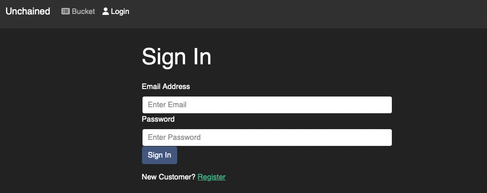
      </a>
    

    
Users will be able to register, and upon loggin in, is authenticated and assigned a token. Registration and login is not required to access the core features of the website but will give access to extensions.

  </ol>
</li>

#### Milestone 2 - Core > Home, Activity and Admin Page

<li>
  <ol>
    <strong>Home Page - Featured Activities</strong>
    
Upon visiting the website, users are shown a set of activities which they can scroll through and click on to get more information. Activities shown are randomly generated every time the page is refreshed and limited to 9 only.

    

      <a href="">
        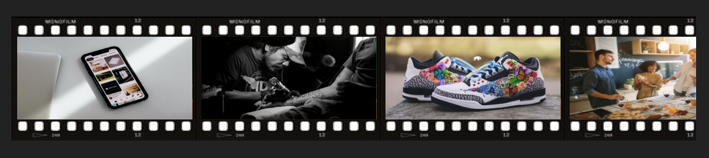
      </a>
    

  </ol>
  <ol>
    <strong>Home Page -  Button Filters</strong>
    
In addition, users can click on the button theme filters which will reveal activities that are associated with that particular theme. Every time a button is clicked, all the buttons will be randomly generated in order to offer a wide variety of themes and also add an element of mystery.

    

      <a href="">
        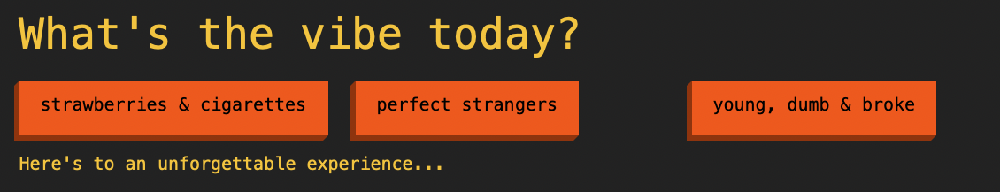
      </a>
    

  </ol>
  <ol>
    <strong>Profile Page</strong>
    
Every user will have their own profile page. Here, users can choose to update their name, email and password.

    

      <a href="">
        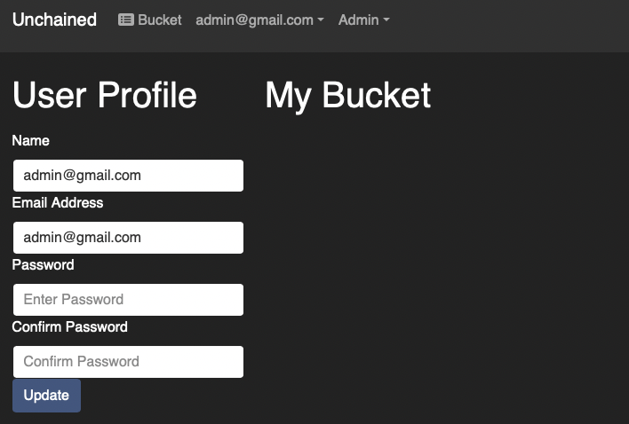
      </a>
    

  </ol>
  <ol>
    <strong>Bucket Page</strong>
    
Users can add activities that they are interested in into this page. In addition, they can delete them as well. This is meant to be the confirmation page before users download activity information.

    

      <a href="">
        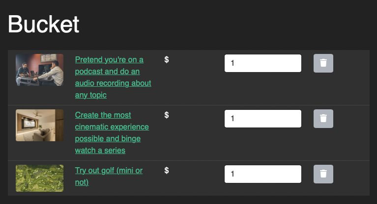
      </a>
    

  </ol>
  <ol>
    <strong>Bucket Page - Download PDF</strong>
    
Users can download a cool pamphlet [WIP] that includes more details about the activities they have chosen, including location and duration.

    

      <a href="">
        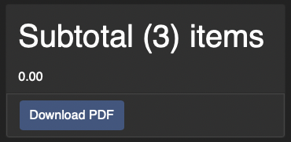
      </a>
    

  </ol>
  <ol>
    <strong>Admin Page</strong>
    
Admins are given access to an additional admin page in the navigation bar where they can edit information about users and activities.

    

      <a href="">
        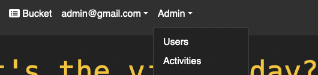
      </a>
    

  </ol>
  <ol>
    <strong>Admin Page - Edit Users</strong>
    
Admins can see the list of users, update or delete user information at this page.

    

      <a href="">
        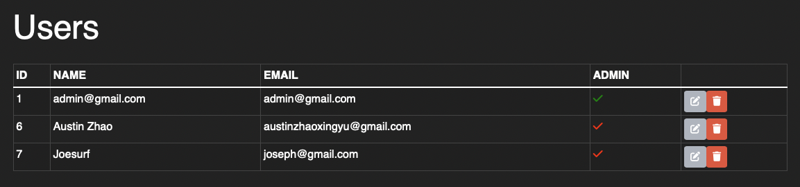
      </a>
    

  </ol>
  <ol>
    <strong>Admin Page - Edit Activities</strong>
    
Admins can see the full list of activities, create, update and delete activities at this page.

    

      <a href="">
        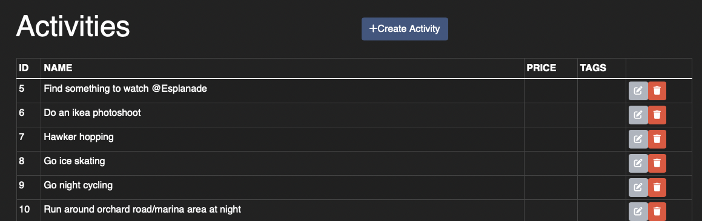
      </a>
    

  </ol>
</li>

#### Milestone 3 - Refinement > Bugs, Edge Features, Testing
<li>
  <ol>
    <strong>Home Page - Activity Info</strong>
    
Upon hovering each of the activity, a card will slide down with the information of the activity and a button to add the activity to the user's bucket list.

    

      <a href="">
        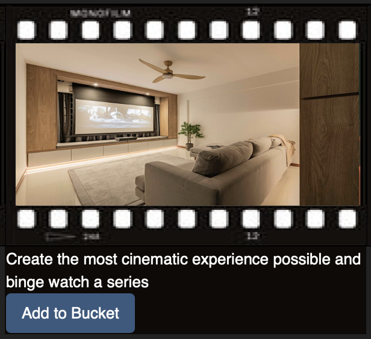
      </a>
    

  </ol>
  <ol>
    <strong>PDF Design</strong>
    
A PDF page of the activities that users have saved to their bucket list for reference and sharing.

    

      <a href="">
        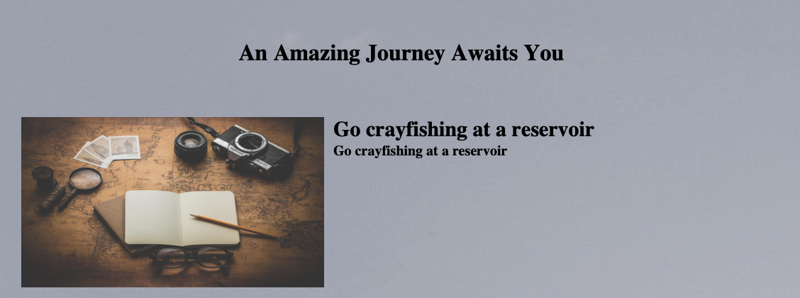
      </a>
    

  </ol>
  <ol>
    <strong>Testing</strong>
    
Conducted system testing to check for usability of core functionality. Conducted user testing to get user feedback.

  </ol>
</li>

### Concept Design 

#### Entity Relationship Diagram

Users can create experiences using buckets which is a set of activities they can do. Each bucket can be filled with various activities which are filtered by cost, location and pax. In addition, users can write notes for each experience and download them in a pdf. 

  

(<a href="#top">back to top</a>)

### Built With

- [React.js](https://reactjs.org/)
- [Bootstrap](https://getbootstrap.com)
- [Django](https://www.djangoproject.com)
- [DjangoRestFramework](https://www.django-rest-framework.org)
- [PostgreSQL](https://www.postgresql.org)
- [AWS](https://aws.amazon.com)

(<a href="#top">back to top</a>)

<!-- ROADMAP -->

## Roadmap

<a href="www.sgunchained.com"><strong>Check out the website»</strong></a>

- [x] User Login and Registration
- [x] Activities Page
- [x] Bucket Selection 
- [x] Admin Page
- [ ] Recommendation Feature
- [x] PDF Download Feature

(<a href="#top">back to top</a>)

<!-- CONTACT -->

## Contact

Joseph Ong - joesurf.rk@gmail.com

Stefanie Sew - stefaniesew@gmail.com

(<a href="#top">back to top</a>)

<!-- ACKNOWLEDGMENTS -->

<!-- ## Acknowledgments

- 
- 
- 

(<a href="#top">back to top</a>)

<!-- MARKDOWN LINKS & IMAGES -->
<!-- https://www.markdownguide.org/basic-syntax/#reference-style-links -->

<!-- [contributors-shield]: https://img.shields.io/github/contributors/github_username/repo_name.svg?style=for-the-badge
[contributors-url]: https://github.com/github_username/repo_name/graphs/contributors
[forks-shield]: https://img.shields.io/github/forks/github_username/repo_name.svg?style=for-the-badge
[forks-url]: https://github.com/github_username/repo_name/network/members
[stars-shield]: https://img.shields.io/github/stars/github_username/repo_name.svg?style=for-the-badge
[stars-url]: https://github.com/github_username/repo_name/stargazers
[issues-shield]: https://img.shields.io/github/issues/github_username/repo_name.svg?style=for-the-badge
[issues-url]: https://github.com/github_username/repo_name/issues
[license-shield]: https://img.shields.io/github/license/github_username/repo_name.svg?style=for-the-badge
[license-url]: https://github.com/github_username/repo_name/blob/master/LICENSE.txt
[linkedin-shield]: https://img.shields.io/badge/-LinkedIn-black.svg?style=for-the-badge&logo=linkedin&colorB=555
[linkedin-url]: https://linkedin.com/in/linkedin_username-->
